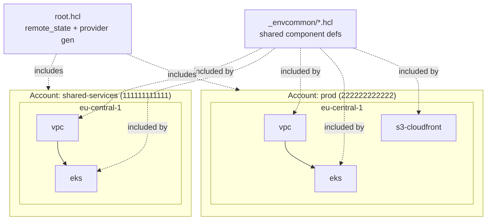

# terragrunt-aws-platform

[](https://terragrunt.gruntwork.io/)
[](https://www.terraform.io/)
[](https://registry.terraform.io/providers/hashicorp/aws/latest)
[](LICENSE)

A DRY, multi-account, multi-region AWS platform managed with **Terragrunt** over reusable **Terraform** modules. Account/region/component context is derived from the folder hierarchy, shared component definitions live in `_envcommon/`, and inter-component ordering (e.g. `vpc` → `eks`) is declared with Terragrunt `dependency` blocks.

## 🧭 Architecture



Each leaf `terragrunt.hcl` `include`s `root.hcl` (backend + provider generation) and the matching `_envcommon` component definition, then overrides only the inputs that differ for that environment. The `eks` unit declares `dependency "vpc"`, so `terragrunt run-all apply` plans and applies the VPC before the cluster automatically.

## ✨ Features

- **DRY via `_envcommon`** — one definition per component (`vpc`, `eks`, `s3-cloudfront`); leaf units override only what changes per environment. No copy-pasted backend or provider blocks anywhere.
- **Centralized remote state** — S3 backend (encrypted) + DynamoDB lock table, with the state key derived from `path_relative_to_include()` so every unit lands in a predictable, collision-free location.
- **Generated providers** — `root.hcl` generates the `aws` provider with cross-account `assume_role` and `default_tags`, plus pinned `versions.tf`, for every unit.
- **Dependency-ordered rollouts** — `dependency` blocks wire module outputs and define apply order; `mock_outputs` keep `validate`/`plan` working on a clean checkout (and in CI).
- **Multi-account / multi-region by construction** — account and region context come from `account.hcl` / `region.hcl` discovered up the tree, so adding an account or region is a new folder, not new boilerplate.
- **Production-grade modules** — VPC (public/private subnets, NAT strategy, flow logs), EKS (managed node groups, IRSA/OIDC, control-plane logging, add-ons), S3+CloudFront (private origin, OAC, security headers, optional ACM/Route53).

## 🗂️ Repository Structure

```
terragrunt-aws-platform/
├── root.hcl                     # remote_state, provider/versions generation, common inputs
├── _envcommon/                  # shared component definitions (DRY)
│   ├── vpc.hcl
│   ├── eks.hcl                  # declares dependency on ../vpc
│   └── s3-cloudfront.hcl
├── accounts/
│   ├── shared-services/
│   │   ├── account.hcl          # account_name + account_id
│   │   └── eu-central-1/
│   │       ├── region.hcl
│   │       ├── vpc/terragrunt.hcl
│   │       └── eks/terragrunt.hcl
│   └── prod/
│       ├── account.hcl
│       └── eu-central-1/
│           ├── region.hcl
│           ├── vpc/terragrunt.hcl
│           ├── eks/terragrunt.hcl
│           └── s3-cloudfront/terragrunt.hcl
├── modules/                     # reusable Terraform modules
│   ├── vpc/
│   ├── eks/
│   └── s3-cloudfront/
├── examples/                    # plain-Terraform usage of each module
│   ├── eks/
│   └── s3-cloudfront/
├── .github/workflows/ci.yml     # hclfmt, fmt, tflint, tfsec, validate matrix
├── .pre-commit-config.yaml
└── LICENSE
```

## 🚀 Usage

Prerequisites: Terragrunt >= 0.55, Terraform >= 1.5, AWS credentials able to assume `TerragruntDeployRole` in the target accounts. Provision the S3 state bucket and DynamoDB lock table referenced in `root.hcl` first (or let Terragrunt create them on first run).

```bash
# Plan/apply a single unit
cd accounts/prod/eu-central-1/vpc
terragrunt plan
terragrunt apply

# Plan/apply an entire account+region, dependency-ordered (vpc before eks)
cd accounts/prod/eu-central-1
terragrunt run-all plan
terragrunt run-all apply

# Plan the whole platform across all accounts
terragrunt run-all plan --terragrunt-working-dir accounts
```

Try a module standalone without Terragrunt:

```bash
cd examples/eks
terraform init
terraform plan
```

## 🔐 Security

- **State encryption + locking** — S3 backend with `encrypt = true` (customer-managed KMS recommended; alias placeholder included) and a DynamoDB lock table to prevent concurrent-apply corruption.
- **Least privilege** — providers assume a per-account deploy role rather than using long-lived static keys; EKS node role attaches only the required AWS-managed policies; IRSA lets workloads get scoped IAM roles instead of node-wide permissions.
- **Private by default** — S3 origin blocks all public access and is reachable only by its CloudFront distribution via Origin Access Control; CloudFront enforces `redirect-to-https`, TLS 1.2+, HSTS and other security headers.
- **Static analysis in CI** — `tfsec` (HIGH+) and `tflint` run on every PR via pre-commit and GitHub Actions; `validate` runs with `-backend=false` so no credentials are needed to lint.
- **No secrets in VCS** — `.gitignore` excludes state, `.tfvars`, and `.terragrunt-cache/`; all identifiers in this repo are placeholders (`111111111111`, `example.com`, etc.).

## 🧭 Engineering Case Study

A platform spanning many AWS accounts and environments tends to rot into copy-pasted Terraform: each environment carries its own backend block, provider block, and a slightly-drifted copy of every module call. That duplication is where inconsistencies and outages hide.

This repository captures the pattern I used to keep a large estate DRY and consistent:

- **One source of truth per concern.** Backend config, provider generation, and tagging live once in `root.hcl`. Each component is defined once in `_envcommon/`. A new environment is a thin `terragrunt.hcl` that overrides only the handful of inputs that genuinely differ (CIDR, node sizing, domain) — typically under 15 lines.
- **Context from the filesystem, not from constants.** Account ID and region are read from `account.hcl`/`region.hcl` discovered up the tree, so the same component definition produces correctly-scoped state keys, provider roles, and tags in every account without per-environment edits.
- **Safe, ordered rollouts.** Declaring `dependency "vpc"` in the EKS definition both wires outputs in and lets `run-all` apply infrastructure in the correct order across an environment, while `mock_outputs` keep validation and planning working on fresh checkouts and in CI.

The payoff: dramatically less duplicated HCL, environments that stay structurally identical (so drift is obvious in review), and the ability to roll out a change across every account by editing one shared file. No employer or client names appear here — this is a generalized, sanitized reference implementation.

## 📄 License

[MIT](LICENSE) © Muhammad Imad
